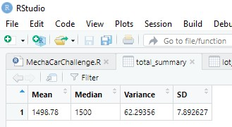
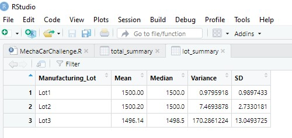
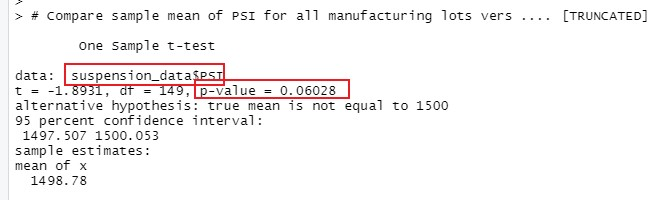
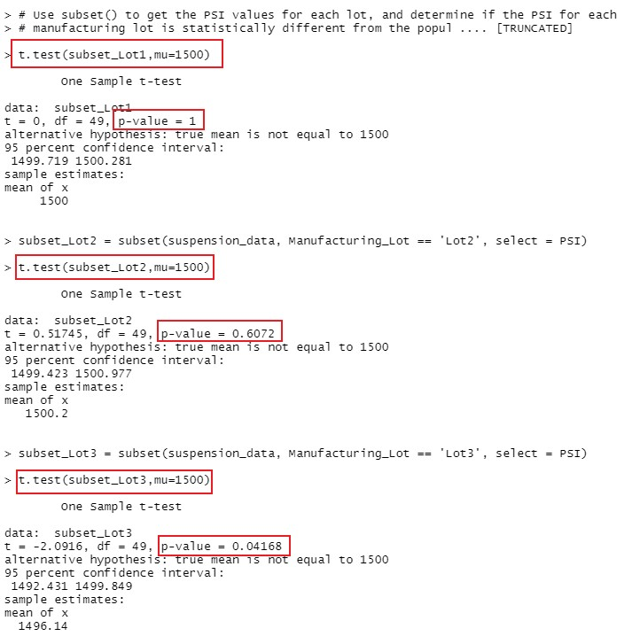

# MechaCar_Statistical_Analysis
Demostrate how to use R and statistics in order to analyze vehicle data.

## Data Source
1. MechaCar MPG dataset [MechaCar_mpg.csv](MechaCar_mpg.csv)
2. Suspension Coil dataset [Suspension_Coil.csv](Suspension_Coil.csv)

## Linear Regression to Predict MPG

1. Which variables/coefficients provided a non-random amount of variance to the mpg values in the dataset?

* Based on the summary from the multiple linear regression model, the following variables/coefficients have the p-value smaller than our assumed significance level of 0.05%, and thus provided a non-random amount of variance to the mpg values in the dataset:
    1. Intercept
    2. vehicle_length
    3. ground_clearance

2. Is the slope of the linear model considered to be zero? Why or why not?
* Based on the output of the `lm()` function, the multiple linear regression model for our dataset would be `mpg = 6.27 * vehicle_length + 0.00125 * vehicle_weight + 0.0688 * spoiler_angle + 3.55 * ground_clearance - 3.41 * AWD - 104`
* In addition, the p-value is 5.35e-11, which is much smaller than our assumed significance level of 0.05%.
* Therefore, we can state that there is sufficient evidence to reject the null hypothesis (H0: The slope of the linear model is zero), which means that the slope of our linear model is not zero.

3. Does this linear model predict mpg of MechaCar prototypes 
effectively? Why or why not?
* The R-Squared value is 0.7149, which means that about 71% of the variablilty of our dependent variable (mpg) is explained using this linear model.
* This indicates our model can predict mpg of MechaCar prototypes effectively.
* However, the intercept is statistically significant (with probability = 5.08e-08), which means that the significant features (such as vehicle_length or ground_clearance) may need scaling or transforming to help improve the predictive power of the model. Alternatively, it may mean that there are other variables that have not been included in our model.

## Summary Statistics on Suspension Coils

1. The design specifications for the MechaCar suspension coils dictate that the variance of the suspension coils must not exceed 100 pounds per square inch. Does the current manufacturing data meet this design specification for all manufacturing lots in total and each lot individually? Why or why not?

* From the `total_summary`, the variance is 62.29 which is less than our assumed variance of 100.  Thus, the current manufacturing data meet this design specification for all manufacturing lots in total.
* From the `lot_summary`, the variance for Lot 1 & 2 are 0.98 and 7.47 which are well below the assumed variance of 100.  However, the variance for lot 3 is 170.29 which exceeds 100 PSI as required by the design specification.  Hence, lot 1 & 2 meet the requirement, but lot 3 failed to meet the requirement as stated in the design specification.

## T-Tests on Suspension Coils

* In the t-test that compares all manufacturing lots against mean PSI of the population, the p-value is **0.06028**, which is above the assumed significance level of 0.05%.  Therefore, we do not have sufficient evidence to reject the null hypothesis, and we would state that **the two means (mean PSI from all manufacturing lots, and mean PSI of the population) are statistically similar**.

* In the t-test from individual manufacturing lot against mean PSI of the population, there is the result:
    * Lot 1: p-value is **1**, which is well above the assumed significance level of 0.05%.  Therefore, we do not have sufficient evidence to reject the null hypothesis, and we would state that **the two means (mean PSI from Lot 1, and mean PSI of the population) are statistically similar**.
    * Lot 2: p-value is **0.6072**, which is above the assumed significance level of 0.05%.  Therefore, we do not have sufficient evidence to reject the null hypothesis, and we would state that **the two means (mean PSI from Lot 2, and mean PSI of the population) are statistically similar**.
    * Lot 3: p-value is **0.042**, which is below the assumed significance level of 0.05%.  Therefore, we have sufficient evidence to reject the null hypothesis, and we would state that **the two means (mean PSI from Lot 3, and mean PSI of the population) are statistically different**.
