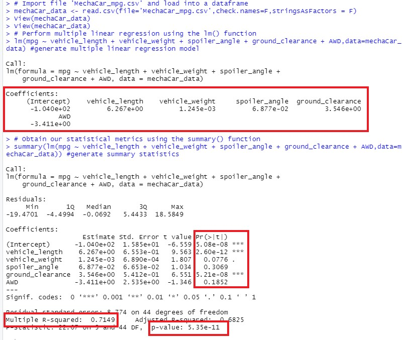

# MechaCar_Statistical_Analysis
Learn how to use R and statistics in order to analyze vehicle data.

## Linear Regression to Predict MPG

1. Which variables/coefficients provided a non-random amount of variance to the mpg values in the dataset?

* Based on the summary from the multiple linear regression model, the following variables/coefficients have the p-value smaller than our assumed significance level of 0.05%, and thus provided a non-random amount of variance to the mpg values in the dataset:
    1. Intercept
    2. vehicle_length
    3. ground_clearance

2. Is the slope of the linear model considered to be zero? Why or why not?
* Based on the output of the `lm()` function, the multiple linear regression model for our dataset would be `mpg = 6.27 * vehicle_length + 0.00125 * vehicle_weight + 0.0688 * spoiler_angle + 3.55 * ground_clearance - 3.41 * AWD - 104`
* In addition, the p-value is 5.35e-11, which is much smaller than our assumed significance level of 0.05%.
* Therefore, we can state that there is sufficient evidence to reject the null hypothesis (H0: The slope of the linear model is zero), which means that the slope of our linear model is not zero.

3. Does this linear model predict mpg of MechaCar prototypes 
effectively? Why or why not?
* The R-Squared value is 0.7149, which means that about 71% of the variablilty of our dependent variable (mpg) is explained using this linear model.
* This indicates our model can predict mpg of MechaCar prototypes effectively.

